# Titan Mini Driver All Example Guide

[**Chinese**](README_zh.md) | **English**

## Introduction

`Titan_Mini_driver_all` is a peripheral driver example collection project for the Titan Mini Board. It centralizes verification of common peripherals, storage, and networking functions. The project exposes individual example entry points for each peripheral through MSH commands, making them convenient to debug independently.

Currently integrated examples:

- RTC
- GPIO / PWM / Key interrupt
- SD Card
- Flash file system
- SDRAM
- ADC
- SPI
- CANFD
- I2C
- Watchdog

## FSP Configuration

This project is based on **Renesas FSP (Flexible Software Package) 6.4.0** and **RT-Thread Studio** for hardware abstraction layer configuration and code generation. It works out of the box without reconfiguration, but follow the workflow below to modify peripheral pins or add new FSP Stacks.

FSP configuration tool download:

- [setup_fsp_v6_4_0_rasc_v2025-12.exe](https://github.com/renesas/fsp/releases/download/v6.4.0/setup_fsp_v6_4_0_rasc_v2025-12.exe)

### Version Requirements

| Item | Version | Note |
|------|---------|------|
| **FSP version** | 6.4.0 | Pinned by `#FSPVersion#` in `configuration.xml` |
| **MCU** | R7KA8P1KFLCAC (RA8P1) | Cortex-M85 + Cortex-M33 dual-core |
| **IDE** | RT-Thread Studio | Bundled with the FSP configuration plug-in |

> ⚠️ Always use FSP 6.4.0. Other versions may cause regenerated `ra/`, `ra_gen/`, `ra_cfg/` code to be incompatible with the driver layer.

### Project Directory Layout

```
Titan_Mini_driver_all/
├── configuration.xml      # FSP configuration (pins / clocks / Stack definitions)
├── ra/                    # FSP-generated driver sources (r_gpt/r_spi/r_canfd etc.)
├── ra_cfg/                # FSP configuration headers (fsp_cfg/)
├── ra_gen/                # FSP auto-generated HAL data (hal_data.c/h)
├── board/                 # BSP board-level initialization
├── src/                   # Application-layer example code (rt_example_*.c)
└── rtconfig.h             # RT-Thread kernel configuration
```

### Steps to Modify the FSP Configuration

1. **Open configuration**: In RT-Thread Studio, right-click the project → `Renesas FSP Configuration` (or double-click `configuration.xml`).
2. **Adjust Stacks**: In the `Stacks` view, add/remove driver Stacks (such as `r_gpt`, `r_adc`, `r_canfd`). The properties of each Stack must match the channel/pins described in the corresponding peripheral section.
3. **Configure pins**: In the `Pins` view, assign pin modes (GPIO/SPI/I2C/CAN, etc.). Ethernet-related pins must have their drive strength set to `H`.
4. **Generate code**: Click `Generate Project Content`. FSP will regenerate `ra_gen/hal_data.c`, `ra_gen/pin_data.c`, and the configuration headers under `ra_cfg/`.
5. **Sync RT-Thread Settings**: In `RT-Thread Settings`, tick the corresponding driver frameworks (PWM / ADC / CAN / SPI / I2C / WDT, etc.) so that the RT-Thread device framework registers the corresponding device nodes (such as `pwm12`, `adc0`, `canfd0`).
6. **Rebuild**: After FSP generates code, you must clean and then build to avoid stale `.o` caches causing link errors.

### Common Issues

- **`pwm12` / `adc0` not found**: Usually because the corresponding driver framework is not ticked in RT-Thread Settings, or the FSP Stack is not added.
- **`hal_data.h` errors**: FSP version mismatch. Regenerate with 6.4.0.
- **ETH pin communication abnormal**: Confirm that all ETH pins have their drive strength set to `H` (see the Ethernet section).
- **Link errors after modifying configuration**: Run `Project → Clean`, then build.

## Build and Run

1. Open the `project/Titan_Mini_driver_all` project in RT-Thread Studio.
2. Compile and download the firmware to the Titan Mini development board.
3. Enter the MSH command line through the serial terminal or USB PCDC terminal.
4. Enter `help` to see available commands. Example commands for each peripheral are described in the following sections.

After power-on, the terminal prints the following boot banner:

```text
============================================================
           Titan Mini Board Factory Test System
============================================================
System initialized successfully!
```

## RTC Example

### Introduction

The RTC example is based on the **RT-Thread RTC device driver framework**. It verifies the proper operation of the RA8P1 on-chip real-time clock, supporting date/time set and read operations. When the `RT_USING_ALARM` component is enabled, it also verifies the alarm function. The RTC is driven by a 32.768 kHz crystal; when main power is removed, time can be backed up via the VBATT battery.

### Hardware Parameters

| Parameter | Specification | Note |
|-----------|---------------|------|
| **Clock source** | 32.768 kHz crystal | Sub-clock oscillator, ±5 ppm accuracy |
| **Calendar range** | 2000–2099 | Automatic leap-year compensation |
| **Time format** | 24-hour | HH:MM:SS |
| **Operating voltage** | 1.62–3.6 V | Wide voltage range |
| **Backup power** | VBATT | Keeps time information after main power loss |
| **Alarm triggers** | sec / min / hour / day / week / month / year | Multiple programmable triggers |

### Usage Steps

1. Enter `rtc_sample` to set the RTC date to 2025-8-1, time to 15:00:00, and read and print the current time after 3 seconds.
2. If the project enables `RT_USING_ALARM`, enter `alarm_sample` to create a second-level alarm.

### Key Code

The example source is in `src/rt_example_rtc.c`. The core logic is shown below.

#### Time Set and Read

```c
void rtc_sample(void)
{
    rt_device_t device = rt_device_find(RTC_NAME);     // RTC_NAME = "rtc"
    if (device == RT_NULL)
    {
        rt_kprintf("find %s failed!\n", RTC_NAME);
        return;
    }

    if (rt_device_open(device, 0) != RT_EOK)
    {
        rt_kprintf("open %s failed!\n", RTC_NAME);
        return;
    }

    set_date(2025, 8, 1);                              // set date
    set_time(15, 0, 0);                                // set time

    rt_thread_mdelay(3000);
    time_t now = 0;
    get_timestamp(&now);
    rt_kprintf("now: %.*s", 25, ctime(&now));
}
MSH_CMD_EXPORT(rtc_sample, rtc sample);
```

#### Alarm Creation (depends on `RT_USING_ALARM`)

```c
static void user_alarm_callback(rt_alarm_t alarm, time_t timestamp)
{
    rt_kprintf("user alarm callback function.\n");
}

void alarm_sample(void)
{
    struct rt_alarm_setup setup;
    static rt_alarm_t alarm = RT_NULL;
    time_t now = get_timestamp(RT_NULL) + 1;            // trigger next second
    struct tm p_tm;
    gmtime_r(&now, &p_tm);

    setup.flag = RT_ALARM_SECOND;                       // second-level alarm
    setup.wktime = *(struct tm *)&p_tm;                 // trigger moment

    alarm = rt_alarm_create(user_alarm_callback, &setup);
    rt_alarm_start(alarm);
}
```

> If `RT_USING_ALARM` is not enabled, `alarm_sample` prints `alarm sample is unavailable: RT_USING_ALARM is not enabled.`.

### Result

- `rtc_sample` prints the current RTC time after setting it.
- `alarm_sample` prints `user alarm callback function.` when triggered.

Terminal output after running `alarm_sample`:

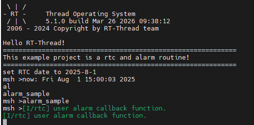

## GPIO / PWM / Key Interrupt Example

### Introduction

These examples are based on the **RT-Thread PWM device driver framework** and the **PIN device interrupt interface**. They verify the RA8P1 GPT general-purpose PWM timer and GPIO external interrupt functionality. Two entry points are provided:

- `pwm_sample`: manually configure the period and duty cycle of `pwm12` for oscilloscope observation.
- `key_irq_sample`: configure the key falling-edge interrupt; the green LED toggles on each trigger.

### Hardware Parameters

| Parameter | Specification | Note |
|-----------|---------------|------|
| **PWM device** | `pwm12` (GPT12) | 32-bit general-purpose PWM timer |
| **PWM counter** | 32-bit | Range 0 – 4294967295 |
| **PWM output pin** | P714 (GTIOC12A) | Oscilloscope probe point |
| **LED pin** | `BSP_IO_PORT_01_PIN_08` | Green LED |
| **Key pin** | `BSP_IO_PORT_02_PIN_01` | Internal pull-up, falling-edge trigger |
| **GPT modes** | Periodic / One-shot / PWM | Square / Sawtooth / Triangle wave |

### Usage Steps

1. Enter `pwm_sample <period> <pulse>`, e.g. `pwm_sample 500000 250000` (units in ns → 2 kHz / 50% duty). Connect an oscilloscope to P714 to observe the waveform.
2. Enter `key_irq_sample`, then press the key to toggle the green LED.

### Key Code

The PWM example is in `src/rt_example_gpt.c`, and the key interrupt example is in `src/rt_example_key_irq.c`.

#### PWM Configuration (manual period and pulse)

```c
#define PWM_DEV_NAME        "pwm12"
#define PWM_DEV_CHANNEL     0

static int pwm_sample(int argc, char *argv[])
{
    rt_uint32_t period = (rt_uint32_t) atoi(argv[1]);
    rt_uint32_t pulse  = (rt_uint32_t) atoi(argv[2]);

    if ((period == 0) || (pulse > period))
    {
        rt_kprintf("invalid parameters, ensure period > 0 and pulse <= period.\n");
        return -RT_ERROR;
    }

    struct rt_device_pwm *pwm_dev = (struct rt_device_pwm *) rt_device_find(PWM_DEV_NAME);
    rt_pwm_set(pwm_dev, PWM_DEV_CHANNEL, period, pulse);
    rt_pwm_enable(pwm_dev, PWM_DEV_CHANNEL);

    rt_kprintf("pwm started on %s channel %d, period=%u pulse=%u\n",
               PWM_DEV_NAME, PWM_DEV_CHANNEL, period, pulse);
    return RT_EOK;
}
MSH_CMD_EXPORT(pwm_sample, configure and start pwm output: pwm_sample <period> <pulse>);
```

#### Key Interrupt (toggle LED on falling edge)

```c
#define LED_PIN_G   BSP_IO_PORT_01_PIN_08
#define KEY_PIN     BSP_IO_PORT_02_PIN_01

static volatile rt_bool_t g_key_flag = RT_FALSE;

static void key_irq_callback(void *args)
{
    rt_pin_write(LED_PIN_G, g_key_flag ? PIN_HIGH : PIN_LOW);
    g_key_flag = g_key_flag ? RT_FALSE : RT_TRUE;
}

void key_irq_sample(void)
{
    rt_pin_mode(LED_PIN_G, PIN_MODE_OUTPUT);
    rt_pin_mode(KEY_PIN, PIN_MODE_INPUT_PULLUP);
    rt_pin_attach_irq(KEY_PIN, PIN_IRQ_MODE_FALLING, key_irq_callback, RT_NULL);
    rt_pin_irq_enable(KEY_PIN, PIN_IRQ_ENABLE);
}
MSH_CMD_EXPORT(key_irq_sample, key interrupt sample);
```

### Parameter Conversion

Parameters of `pwm_sample` are in **nanoseconds**:

```
Frequency = 1e9 / period
Duty cycle = pulse / period × 100%

Example pwm_sample 500000 250000:
  Frequency = 1e9 / 500000 = 2000 Hz (2 kHz)
  Duty cycle = 250000 / 500000 = 50%
```

### Result

- On success, `pwm_sample` prints the device, channel, period, and pulse. The waveform can be observed on P714.
- After `key_irq_sample` starts, every falling edge of the key toggles the green LED once.

Terminal output of `pwm_sample 500000 250000`:

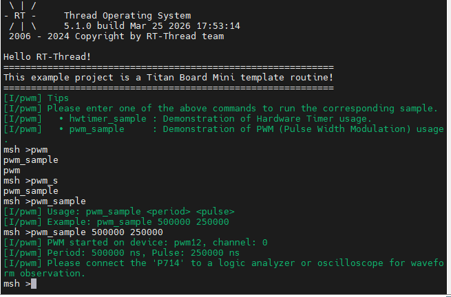

The 2 kHz / 50% PWM waveform observed on P714 with an oscilloscope:

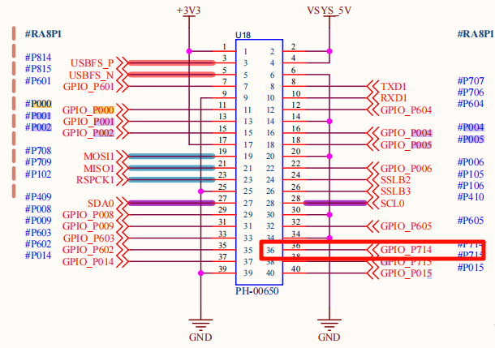

## SD Card Example

### Introduction

The SD card example is based on the **RT-Thread DFS file system framework** and the **RA8 SDHI hardware module**. It verifies that the `/sdcard` mount point can be properly created, written, read, and used to delete test files. SDHI communicates with SD/SDHC/SDXC cards via the SD bus, supporting 1-bit/4-bit data lines and DMA transfer.

### Hardware Parameters

| Parameter | Specification | Note |
|-----------|---------------|------|
| **Supported card types** | SDSC / SDHC / SDXC | Compatible with SD v1.x / v2.x |
| **Bus width** | 1-bit / 4-bit | Project default: 1-bit |
| **Block size** | 512 Byte | Standard block size |
| **Maximum clock** | 50 MHz SDCLK | Depends on MCU clock configuration |
| **Operating voltage** | 3.3 V | Some Micro SD cards support 1.8 V |
| **Error check** | CRC7 (command) / CRC16 (data) | Hardware auto check |

### Usage Steps

1. Confirm the SD card is inserted and automatically mounted at `/sdcard` (handled by `BSP_USING_FS_AUTO_MOUNT` + `BSP_USING_SDCARD_FATFS`).
2. Enter `sdcard_sample` to perform one file read/write verification.

### Key Code

The example source is in `src/rt_example_sdcard.c`, using the standard POSIX `fopen/fputs/fgets/unlink` API.

```c
void sdcard_sample(void)
{
    const char *test_file = "/sdcard/test_sdcard.txt";
    const char *test_data = "SD Card test data - Titan Mini Board";
    char read_buf[64] = {0};

    /* 1. Write test data */
    FILE *fp = fopen(test_file, "w");
    if (fp == RT_NULL)
    {
        rt_kprintf("failed to create test file: %s\n", test_file);
        return;
    }
    fputs(test_data, fp);
    fclose(fp);

    /* 2. Read back and verify */
    fp = fopen(test_file, "r");
    if (fgets(read_buf, sizeof(read_buf), fp) == RT_NULL)
    {
        rt_kprintf("failed to read test data\n");
        fclose(fp);
        return;
    }
    fclose(fp);

    /* 3. Compare content */
    if (strcmp(read_buf, test_data) != 0)
    {
        rt_kprintf("sdcard data mismatch!\n");
        return;
    }

    /* 4. Cleanup */
    unlink(test_file);
    rt_kprintf("sdcard sample passed\n");
}
MSH_CMD_EXPORT(sdcard_sample, sdcard file read write sample);
```

### Result

- On success, the example writes, reads, verifies, and deletes the test file, then prints `sdcard sample passed`.
- On mount failure, write failure, or data mismatch, the corresponding cause is printed (`failed to create/write/read` or `data mismatch`).

Terminal output after the SD card is mounted:

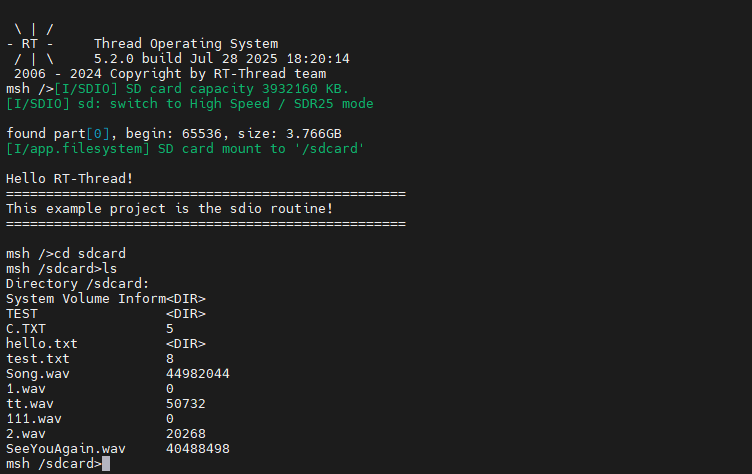

## Flash File System Example

### Introduction

The Flash example is based on the **RT-Thread DFS + FAL + LittleFS** three-layer architecture. It verifies basic read/write capability on the on-board QSPI Flash (W25Q64) at the `/fal` mount point. The bottom layer uses the FAL abstraction layer to manage Flash partitions, and the file system uses power-loss-safe LittleFS.

### Hardware Parameters

| Parameter | Specification | Note |
|-----------|---------------|------|
| **Flash model** | W25Q64 | On-board QSPI NOR Flash |
| **Capacity** | 8 MB (64 Mbit) | 4 KB sector / 64 KB block / 256 B page |
| **Interface** | QSPI (Quad SPI) | 4-bit data line, up to 133 MHz |
| **Operating voltage** | 2.7 V – 3.6 V | — |
| **Endurance** | ~100k erase/program per sector | ~20-year data retention at room temperature |
| **Filesystem partition** | `filesystem` (1 MB) | Defined by the FAL partition table |

### Software Stack

```
Application (flash_sample)
    ↓
DFS (DFS framework, provides fopen/fread/POSIX API)
    ↓
LittleFS (power-loss safe + wear leveling)
    ↓
FAL (Flash abstraction layer, manages partitions)
    ↓
W25Q64 QSPI driver → OSPI_B hardware
```

### Usage Steps

1. Confirm that FAL and LittleFS are enabled and automatically mounted at `/fal` (handled by `BSP_USING_FLASH_FS_AUTO_MOUNT`; on first mount failure it will automatically `dfs_mkfs("lfs", ...)` to format).
2. Enter `flash_sample` to perform a small-file read/write verification.
3. Enter `flash_speed_test` to perform a 64 KB write/read/delete bandwidth test.

### Key Code

The example source is in `src/rt_example_flash.c`. It provides two commands: `flash_sample` (functional verification) and `flash_speed_test` (bandwidth test).

#### Functional Verification (flash_sample)

```c
void flash_sample(void)
{
    const char *test_file = "/fal/test_flash.txt";
    const char *test_data = "Flash test data - Titan Mini Board";
    char read_buf[64] = {0};

    /* 1. Write test data */
    FILE *fp = fopen(test_file, "w");
    if (fp == RT_NULL)
    {
        rt_kprintf("failed to create test file: %s\n", test_file);
        return;
    }
    fputs(test_data, fp);
    fclose(fp);

    /* 2. Read back and verify */
    fp = fopen(test_file, "r");
    if (fgets(read_buf, sizeof(read_buf), fp) == RT_NULL)
    {
        rt_kprintf("failed to read test data\n");
        fclose(fp);
        return;
    }
    fclose(fp);

    /* 3. Compare content */
    if (strcmp(read_buf, test_data) != 0)
    {
        rt_kprintf("flash data mismatch!\n");
        return;
    }

    /* 4. Cleanup */
    unlink(test_file);
    rt_kprintf("flash sample passed\n");
}
MSH_CMD_EXPORT(flash_sample, flash file read write sample);
```

#### Bandwidth Test (flash_speed_test)

The DWT cycle counter is used to time the write, read, and delete operations on a 64 KB file and convert them to KB/s bandwidth. The read phase also performs data verification.

```c
#define FLASH_SPEED_TEST_SIZE   (64 * 1024)   /* 64 KB test file */
#define FLASH_SPEED_BUF_SIZE    4096          /* single read/write block */

void flash_speed_test(void)
{
    /* 1. Sequentially write 64 KB (4 KB per iteration), DWT-timed */
    dwt_init();
    FILE *fp = fopen("/fal/speed_test.bin", "wb");
    uint32_t start = dwt_get_cycle();
    for (offset = 0; offset < total; offset += FLASH_SPEED_BUF_SIZE)
        fwrite(wr_buf, 1, FLASH_SPEED_BUF_SIZE, fp);
    fflush(fp); fclose(fp);
    flash_speed_report("Write", dwt_get_cycle() - start, total);

    /* 2. Sequential read + data verification, DWT-timed */
    fp = fopen("/fal/speed_test.bin", "rb");
    start = dwt_get_cycle();
    for (offset = 0; offset < total; offset += FLASH_SPEED_BUF_SIZE)
    {
        fread(rd_buf, 1, FLASH_SPEED_BUF_SIZE, fp);
        if (memcmp(rd_buf, wr_buf, FLASH_SPEED_BUF_SIZE) != 0) { /* verification failed */ }
    }
    flash_speed_report("Read", dwt_get_cycle() - start, total);
    fclose(fp);

    /* 3. Delete the file (corresponds to Flash erase), DWT-timed */
    start = dwt_get_cycle();
    unlink("/fal/speed_test.bin");
    flash_speed_report("Erase", dwt_get_cycle() - start, total);
}
MSH_CMD_EXPORT(flash_speed_test, flash read/write speed test);
```

Bandwidth conversion formula (same as SDRAM):

```
Elapsed (s) = DWT delta / SystemCoreClock
Bandwidth (KB/s) = (test bytes / 1024) / elapsed
```

### Result

- `flash_sample` prints `flash sample passed` on success; on failure it prints `failed to create/write/read` or `flash data mismatch!`.
- `flash_speed_test` reports `Write`, `Read`, and `Erase` bandwidth (KB/s) and elapsed time (ms), and verifies data during the read phase.

> Flash must be erased before writing and must be aligned to sector/page boundaries. LittleFS automatically handles wear leveling and power-loss protection; the application layer simply uses POSIX interfaces.

Terminal output after the Flash file system is mounted:

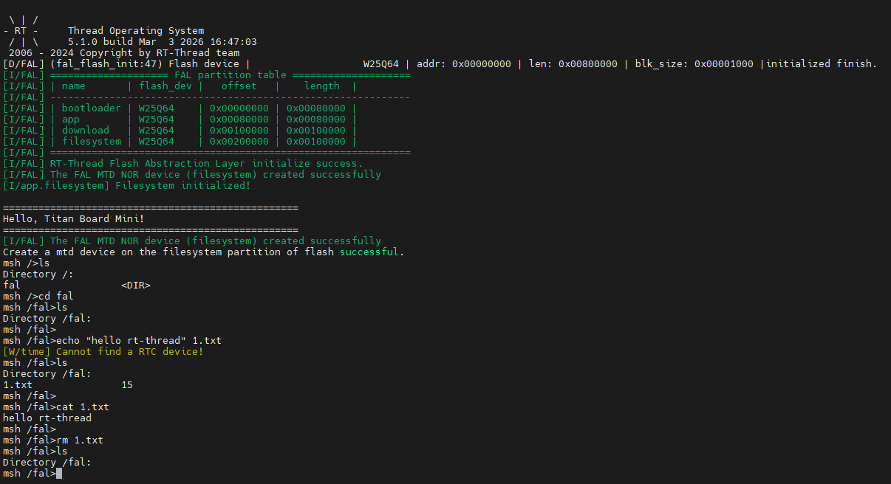

## SDRAM Example

### Introduction

The SDRAM example is based on the **RA8P1 SDRAMC controller**. It verifies that the external 64 MB SDRAM is readable/writable and uses the DWT cycle counter to report write, read, and `memcpy` bandwidth.

### Hardware Parameters

| Parameter | Specification | Note |
|-----------|---------------|------|
| **Capacity** | 64 MB (256 Mbit) | 4 banks × 4 M × 32 bit |
| **Data width** | 32 bit | High-throughput data transfer |
| **Base address** | `0x68000000` | Access range 0x68000000 – 0x68FFFFFF |
| **Operating voltage** | 3.3 V | — |
| **CAS latency** | CL3 | Programmable timing |
| **Refresh** | Auto refresh | Built into SDRAMC, ensures data integrity |

### Usage Steps

1. Enter `sdram_speed_test` to perform one SDRAM speed test.

### Key Code

The example source is in `src/rt_example_sdram.c`. It uses the DWT cycle counter for nanosecond-level timing.

#### Memory Mapping and Timing Helpers

```c
#define SDRAM_TEST_WORDS   (8 * 1024 * 1024)             // 8 M words = 32 MB
#define SDRAM_BASE_ADDR    (0x68000000)

static volatile uint32_t *sdram_buf = (uint32_t *) SDRAM_BASE_ADDR;

static void dwt_init(void)
{
    CoreDebug->DEMCR |= CoreDebug_DEMCR_TRCENA_Msk;
    DWT->CYCCNT = 0;
    DWT->CTRL  |= DWT_CTRL_CYCCNTENA_Msk;
}
```

### Result

- The terminal prints the test capacity, CPU frequency, and `Write`, `Read`, and `memcpy` bandwidth results (MB/s and ms).
- If a read-back verification mismatch occurs, it prints the error address and the expected/actual values (`expect_low16` / `actual_low16`).

`sdram_speed_test` output:

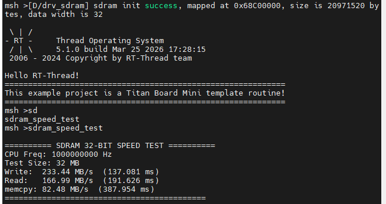

## ADC Example

### Introduction

The ADC example is based on the **RT-Thread ADC device driver framework**. It verifies that channel 0 of `adc0` on the RA8P1 can sample correctly and converts the raw value to a voltage. The example also adds **invalid-value detection** and **near-full-scale warning** logic to avoid mistaking inputs above the reference voltage for valid samples.

### Hardware Parameters

| Parameter | Specification | Note |
|-----------|---------------|------|
| **Resolution** | 16 bit | Raw value range 0 – 65535 |
| **Reference voltage** | 3.3 V | Expressed in code as `330` (3.30 V × 100, fixed-point) |
| **Sample channel** | `adc0` channel 0 | Single-ended input, range 0 V – 3.3 V |
| **Trigger** | Software trigger | Periodic sampling via `rt_adc_read` |

> ⚠️ **Important**: The input voltage must be below the reference voltage Vref. Applying 3.3 V directly may trigger a full-scale warning or overflow message.

### Usage Steps

1. Connect the analog voltage under test to the corresponding ADC channel (input should be below Vref).
2. Enter `adc_sample` to start the continuous sampling thread, which outputs the raw value and converted voltage once per second.

### Key Code

The example source is in `src/rt_example_adc.c`. The core logic is shown below.

#### Voltage Conversion Constants

```c
#define ADC_DEV_NAME        "adc0"
#define ADC_DEV_CHANNEL     0
#define REFER_VOLTAGE       330              // 3.30 V × 100, fixed-point with 2 decimals
#define CONVERT_BITS        (1 << 16)        // 16-bit resolution
#define ADC_INVALID_VALUE   0xFFFF           // ADC overrange marker
#define ADC_WARN_THRESHOLD  (CONVERT_BITS * 95 / 100)  // 95% full-scale warning threshold
```

#### Sampling Thread Main Loop

```c
static void adc_vol_sample(void *parameter)
{
    rt_adc_device_t adc_dev = (rt_adc_device_t)rt_device_find(ADC_DEV_NAME);
    if (adc_dev == RT_NULL)
    {
        rt_kprintf("adc sample run failed! can't find %s device!\n", ADC_DEV_NAME);
        return;
    }

    if (rt_adc_enable(adc_dev, ADC_DEV_CHANNEL) != RT_EOK)
    {
        rt_kprintf("adc enable failed! channel = %d\n", ADC_DEV_CHANNEL);
        return;
    }

    while (1)
    {
        rt_uint32_t value = rt_adc_read(adc_dev, ADC_DEV_CHANNEL);

        if (value == ADC_INVALID_VALUE)
        {
            rt_kprintf("adc overrange: input is too high, please keep it below Vref.\n");
        }
        else
        {
            rt_uint32_t vol = value * REFER_VOLTAGE / CONVERT_BITS;
            rt_kprintf("the value is :%d\n", value);

            if (value >= ADC_WARN_THRESHOLD)
                rt_kprintf("warning: near full scale, the voltage is :%d.%02d\n", vol / 100, vol % 100);
            else
                rt_kprintf("the voltage is :%d.%02d\n", vol / 100, vol % 100);
        }

        rt_thread_mdelay(1000);
    }
}
```

#### Command Export

```c
void adc_sample(void)
{
    rt_thread_t adc = rt_thread_create("adc", adc_vol_sample, RT_NULL, 1024, 10, 10);
    if (adc == RT_NULL)
    {
        rt_kprintf("create adc thread failed!\n");
        return;
    }
    rt_thread_startup(adc);
}
MSH_CMD_EXPORT(adc_sample, adc sample demo);
```

### Voltage Conversion

Fixed-point arithmetic is used to avoid floating-point overhead:

```
Voltage (mV) = ADC reading × Reference voltage (mV) / Conversion bits
             = value × 3300 / 65536

In code: vol = value * 330 / 65536   (unit is 0.01 V)
Display: vol / 100  -> integer part (V)
         vol % 100  -> fractional part (0.01 V)
```

For example, when `value = 32768`, `vol ≈ 165`, the output is `the voltage is :1.65`.

### Result

- `adc_sample` periodically prints the raw sample value and the converted voltage.
- When the reading is `0xFFFF`, it reports `adc overrange` — the input is over range.
- When the reading approaches full scale (≥ 95%), it outputs `warning: near full scale`.

When testing, you can use a jumper wire to connect 3.3 V to the ADC pin for verification:

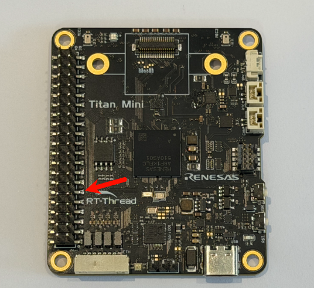

Terminal sampling output after running `adc_sample`:

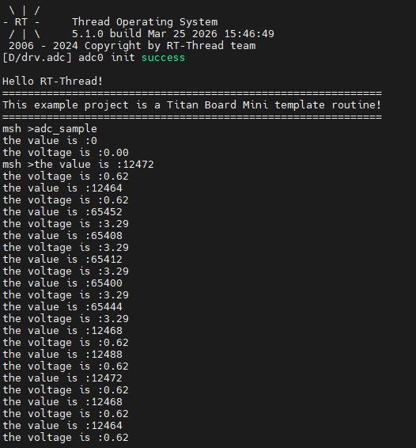

## SPI Example

### Introduction

The SPI example is based on the **RT-Thread SPI device driver framework**. It performs a loopback test on the `spi1` bus, defaulting to 1 MHz, Mode 0, 8-bit data width. MOSI and MISO must be shorted before running the test.

### Hardware Parameters

| Parameter | Specification | Note |
|-----------|---------------|------|
| **SPI bus** | `spi1` | RA8 hardware SPI |
| **Attached device** | `spi10` | Created via `rt_hw_spi_device_attach` |
| **Data width** | 8 bit | Configurable 1–16 bit |
| **Maximum clock** | 25 MHz (depends on system clock) | Example uses 1 MHz |
| **Mode** | Mode 0 (CPOL=0, CPHA=0) | Master + MSB first |
| **Chip select** | Software (`RT_SPI_NO_CS`) | No CS needed for loopback |
| **MOSI/MISO** | P708 / P709 | Raspberry Pi expansion header |

### Usage Steps

1. Short P708 (MOSI) and P709 (MISO) as required by the wiring.
2. Enter `spi_loop_test` to run the basic SPI loopback example.

### Key Code

The example source is in `src/rt_example_spi.c`.

```c
#define SPI_BUS_NAME        "spi1"
#define SPI_NAME            "spi10"

void spi_loop_test(void)
{
    static uint8_t sendbuf[1024];
    static uint8_t readbuf[1024];

    /* 1. Prepare test data 0x00 ~ 0xFF cyclic */
    for (int i = 0; i < (int) sizeof(sendbuf); i++)
        sendbuf[i] = (uint8_t) i;

    /* 2. Attach SPI device and configure */
    rt_hw_spi_device_attach(SPI_BUS_NAME, SPI_NAME, RT_NULL);
    struct rt_spi_configuration cfg = {
        .data_width = 8,
        .mode = RT_SPI_MASTER | RT_SPI_MODE_0 | RT_SPI_MSB | RT_SPI_NO_CS,
        .max_hz = 1 * 1000 * 1000,                 // 1 MHz
    };
    struct rt_spi_device *spi_dev = (struct rt_spi_device *) rt_device_find(SPI_NAME);
    rt_spi_configure(spi_dev, &cfg);

    /* 3. Full-duplex transfer + byte-by-byte compare */
    rt_spi_transfer(spi_dev, sendbuf, readbuf, sizeof(sendbuf));
    for (int i = 0; i < (int) sizeof(readbuf); i++)
    {
        if (readbuf[i] != sendbuf[i])
        {
            rt_kprintf("SPI test fail!!!\n");
            break;
        }
    }
    rt_kprintf("\n\nSPI test end\n");
}
MSH_CMD_EXPORT(spi_loop_test, test spi1);
```

### Result

- `spi_loop_test` prints the contents of the send and receive buffers. When all bytes match, it outputs `SPI test end`.

Wiring point for shorting P708 (MOSI) and P709 (MISO) to form the loopback:

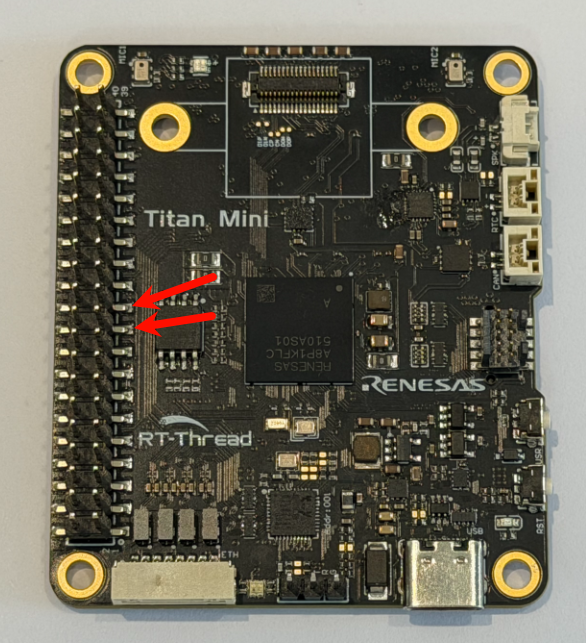

Terminal output after running `spi_loop_test`:

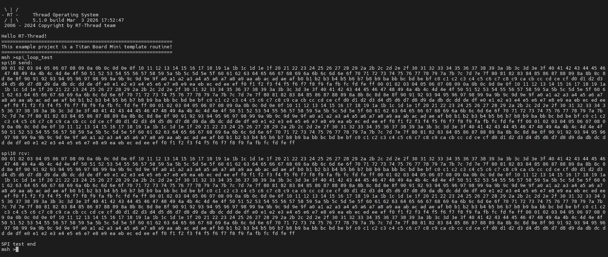

## CANFD Example

### Introduction

The CANFD example is based on the **RT-Thread CAN device driver framework** and the **RA8P1 CANFD controller**. It uses an interrupt-driven + semaphore mechanism to implement asynchronous transmit/receive. The `canfd_test` command spawns independent TX/RX threads that continuously send and receive CAN frames.

### Hardware Parameters

| Parameter | Specification | Note |
|-----------|---------------|------|
| **CANFD channel** | `canfd0` | RA8P1 has 2 independent CANFD channels |
| **Arbitration bitrate** | Up to 1 Mbps | Classic CAN compatible |
| **Data bitrate** | Up to 8 Mbps | CANFD high-speed segment |
| **Frame ID** | `0x78` (standard frame) | 8-byte data `0x00~0x07` |
| **TX buffers** | 16 per channel | — |
| **RX FIFOs** | 2 per channel | Interrupt + semaphore notification |
| **Filters** | 16 rules per channel | — |
| **Error check** | CRC17 / CRC21 | Enhanced CRC |

### Usage Steps

1. Enter `canfd_test` to start the TX/RX threads (after startup, one 8-byte frame with ID `0x78` is sent every second).
2. To interface with an external node, prepare a bus loopback or a peer CAN device to observe received data.

### Key Code

The example source is in `src/rt_example_canfd.c`. It uses interrupt reception + a semaphore to wake the receive thread.

#### RX Callback and RX Thread

```c
static struct rt_semaphore g_can_rx_sem;

static rt_err_t can_rx_indicate(rt_device_t dev, rt_size_t size)
{
    rt_sem_release(&g_can_rx_sem);          // release semaphore in ISR to wake RX thread
    return RT_EOK;
}

static void can_rx_thread(void *parameter)
{
    struct rt_can_msg rxmsg = {0};
    rt_device_set_rx_indicate(g_can_dev, can_rx_indicate);

    while (1)
    {
        rxmsg.hdrindex = -1;
        rt_sem_take(&g_can_rx_sem, RT_WAITING_FOREVER);

        if (rt_device_read(g_can_dev, 0, &rxmsg, sizeof(rxmsg)) > 0)
        {
            rt_kprintf("ID:%x message:", rxmsg.id);
            for (rt_uint8_t i = 0; i < rxmsg.len; i++)
                rt_kprintf("%d ", rxmsg.data[i]);
            rt_kprintf("\n");
        }
    }
}
```

#### TX Thread and Initialization

```c
static void can_tx_thread(void *parameter)
{
    struct rt_can_msg txmsg = {0};
    txmsg.id  = 0x78;
    txmsg.ide = RT_CAN_STDID;       // standard frame
    txmsg.rtr = RT_CAN_DTR;         // data frame
    txmsg.len = 8;

    while (1)
    {
        for (rt_uint8_t i = 0; i < txmsg.len; i++)
            txmsg.data[i] = i;

        rt_device_write(g_can_dev, 0, &txmsg, sizeof(txmsg));   // send one frame per second
        rt_thread_mdelay(1000);
    }
}

int canfd_test(void)
{
    rt_sem_init(&g_can_rx_sem, "canrx", 0, RT_IPC_FLAG_FIFO);
    g_can_dev = rt_device_find("canfd0");
    rt_device_open(g_can_dev, RT_DEVICE_FLAG_INT_TX | RT_DEVICE_FLAG_INT_RX);

    rt_thread_startup(rt_thread_create("can_rx", can_rx_thread, RT_NULL, 2048, 15, 10));
    rt_thread_startup(rt_thread_create("can_tx", can_tx_thread, RT_NULL, 2048, 14, 10));
    return RT_EOK;
}
MSH_CMD_EXPORT(canfd_test, canfd test);
```

### Result

- After `canfd_test` starts, it periodically prints `canfd tx ok`, and prints `ID:<id> message:<data...>` when a frame is received.

CAN connector location on the board (note: CAN_H / CAN_L must not be swapped):

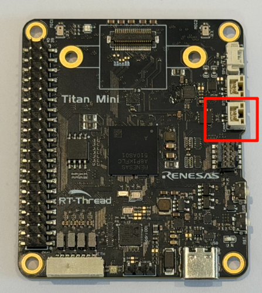

Terminal TX/RX output after running `canfd_test`:

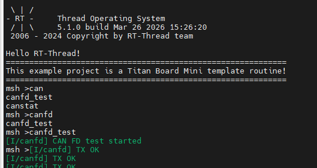

## I2C Example

### Introduction

The I2C example is based on the **RT-Thread I2C device driver framework**. It reads the on-board **LSM6DS3TR-C** 6-axis IMU sensor (accelerometer + gyroscope + temperature) via the on-board software I2C bus `i2c1`, and prints the parsed physical quantities along with a static attitude estimate — a complete I2C sensor read-out example.

### Hardware Parameters

| Parameter | Specification | Note |
|-----------|---------------|------|
| **I2C bus** | `i2c1` | On-board software I2C (SCL=PIN1292, SDA=PIN1291) |
| **Target device** | LSM6DS3TR-C | On-board 6-axis IMU |
| **Device address** | `0x6A` | 7-bit address, WHO_AM_I=0x6A |
| **Accel full scale** | ±2g | ODR 12.5 Hz, 1 LSB ≈ 0.061 mg |
| **Gyro full scale** | ±2000 dps | ODR 12.5 Hz, 1 LSB ≈ 70 mdps |
| **Temperature precision** | 0.0625 ℃ / LSB | Offset 25 ℃ |

### Usage Steps

1. Confirm that the on-board LSM6DS3TR-C IMU is wired to `i2c1` (SDA/SCL/GND/VCC; the dev board is shipped pre-connected).
2. Enter `i2c_sample`. It will automatically perform: device probe → register configuration → one-shot data acquisition → parsing and printing.

### Key Code

The example source is in `src/rt_example_i2c.c`. The core flow is: first verify WHO_AM_I, then configure the CTRL1_XL / CTRL2_G / CTRL3_C registers, and finally read STATUS_REG to check data-ready and combine 6 bytes of acceleration / 6 bytes of angular rate / 2 bytes of temperature in little-endian order.

```c
#define I2C_BUS_NAME            "i2c1"
#define LSM6DS3TR_C_I2C_ADDR    0x6A
#define LSM6DS3TR_C_WHO_AM_I    0x0F

/* Register read: write register address first, then read N bytes (auto-increment) */
static rt_err_t imu_reg_read(rt_uint8_t reg, rt_uint8_t *buf, rt_uint16_t len)
{
    struct rt_i2c_msg msgs[2];
    msgs[0].addr  = LSM6DS3TR_C_I2C_ADDR;
    msgs[0].flags = RT_I2C_WR;
    msgs[0].buf   = &reg;
    msgs[0].len   = 1;
    msgs[1].addr  = LSM6DS3TR_C_I2C_ADDR;
    msgs[1].flags = RT_I2C_RD;
    msgs[1].buf   = buf;
    msgs[1].len   = len;
    if (rt_i2c_transfer(i2c_bus, msgs, 2) != 2)
        return -RT_ERROR;
    return RT_EOK;
}

void i2c_sample(void)
{
    if (imu_init() != RT_EOK)              /* WHO_AM_I check + configure CTRL1/2/3 */
        return;
    imu_read_and_print();                  /* read accel/gyro/temp and print */
}
MSH_CMD_EXPORT(i2c_sample, read LSM6DS3TR-C IMU sensor via i2c1);
```

### Result

On success, a complete IMU sample is printed, including acceleration (mg), angular rate (dps), temperature (℃), and the pitch / roll estimated from the gravity direction:

```
[I/i2c.imu] LSM6DS3TR-C detected, WHO_AM_I=0x6A
[I/i2c.imu] IMU configured: ODR=12.5Hz, accel ±2g, gyro ±2000dps
------ LSM6DS3TR-C IMU Sample ------
Accel  (mg) : X=   -8.5  Y=   12.3  Z= 1003.4  | |a|= 1003.5
Gyro   (dps): X=   0.12  Y=   -0.05  Z=   0.08  | |w|=   0.15
Temp   (C)  :   28.50
Tilt   (deg): pitch=  -0.49  roll=   0.70  (static estimate)
------------------------------------
```

On failure, possible messages:
- `cannot find i2c bus i2c1`: software I2C bus not registered (check `RT_USING_SOFT_I2C1`).
- `IMU not found, WHO_AM_I=0xXX`: sensor did not respond or address mismatch; check wiring / power.


## Watchdog Example

### Introduction

The Watchdog example is based on the **RT-Thread watchdog device framework** and the **RA8P1 WDT hardware**. It verifies that the `wdt` device can start correctly, and uses an independent thread to simulate the scenario of "feeding the dog normally 10 times, then stopping" to demonstrate the watchdog timeout reset mechanism.

### Hardware Parameters

| Parameter | Specification | Note |
|-----------|---------------|------|
| **WDT device** | `wdt` | RA8P1 on-chip independent watchdog |
| **Independent operation** | Yes | Still counts when CPU is halted |
| **Timeout** | 128/512/.../16384 cycles | Configurable via FSP |
| **Clock divider** | 1/4/16/.../8192 | Multiple options |
| **Reset mode** | Reset mode / NMI mode | Reset mode auto restarts |
| **Feed method** | `RT_DEVICE_CTRL_WDT_KEEPALIVE` | Software control command |
| **Feed interval** | 1000 ms | Defined by `WDT_FEED_INTERVAL` |

### Usage Steps

1. Enter `wdt_sample` to start the watchdog example.
2. Observe the first 10 feed logs (once per second).
3. From the 11th iteration feeding stops. Keep the terminal connected and observe the system reset.

### Key Code

The example source is in `src/rt_example_wdt.c`.

#### Feed Thread (feed for the first 10 times, then stop)

```c
#define WDT_FEED_INTERVAL   1000

static void feed_dog_entry(void *parameter)
{
    int count = 0;
    while (1)
    {
        if (count < 10)
        {
            rt_device_control(g_wdt_dev, RT_DEVICE_CTRL_WDT_KEEPALIVE, RT_NULL);
            rt_kprintf("[FeedDog] Feeding watchdog... %d\n", count);
        }
        else
        {
            rt_kprintf("[FeedDog] Simulate exception! Stop feeding.\n");
        }
        count++;
        rt_thread_mdelay(WDT_FEED_INTERVAL);
    }
}
```

#### Start Watchdog and Feed Thread

```c
int wdt_sample(void)
{
    g_wdt_dev = rt_device_find("wdt");
    if (g_wdt_dev == RT_NULL)
    {
        rt_kprintf("cannot find wdt device!\n");
        return -RT_ERROR;
    }

    if (rt_device_control(g_wdt_dev, RT_DEVICE_CTRL_WDT_START, RT_NULL) != RT_EOK)
    {
        rt_kprintf("start watchdog failed!\n");
        return -RT_ERROR;
    }

    g_feed_thread = rt_thread_create("feed_dog", feed_dog_entry, RT_NULL, 1024, 10, 10);
    rt_thread_startup(g_feed_thread);
    rt_kprintf("watchdog sample started\n");
    return RT_EOK;
}
MSH_CMD_EXPORT(wdt_sample, wdt_sample);
```

### Result

- On startup it prints `watchdog sample started`.
- For the first 10 iterations it prints `[FeedDog] Feeding watchdog... <n>` once per second.
- After that it keeps printing `[FeedDog] Simulate exception! Stop feeding.`. If the WDT is configured in reset mode, the system will automatically reset after timeout.

Feed and stop-feed output after running `wdt_sample`:

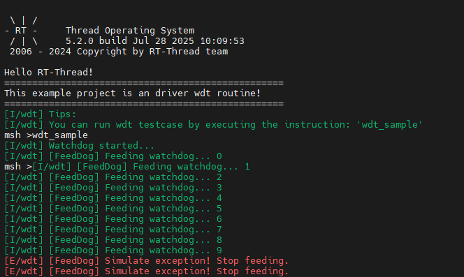
