# Ethernet 示例说明

**中文** | [**English**](./README.md)

## 简介

本示例展示了如何在 **Titan Board Mini** 上使用 **以太网接口**，结合 **RT-Thread Ethernet 驱动框架** 实现网络通信功能。

主要功能包括：

- 初始化 RA8 系列以太网硬件
- 配置 IP 地址、子网掩码和网关
- 发送和接收以太网帧
- 集成 RT-Thread `netdev` 框架，实现统一网络设备管理
- 支持 DMA 和中断，实现高速数据传输

## 以太网（Ethernet）简介

### 1. 概述

**以太网（Ethernet）** 是最广泛使用的局域网（LAN）技术，由 Xerox PARC 在 1970 年代提出，后由 IEEE 802.3 标准化。以太网具有以下特点：

- **数据传输方式**：基于 **帧（Frame）** 的分组交换，物理上可通过双绞线、光纤或无线介质传输。
- **拓扑结构**：传统以太网为总线或星型拓扑，现代以太网主要采用星型和树型。
- **协议层次**：属于 OSI 模型的数据链路层（第 2 层）及物理层（第 1 层）技术。

### 2. 以太网帧结构

以太网使用 **帧（Frame）** 作为数据传输单位。以太网帧由以下字段组成：

| 字段                | 长度         | 描述                       |
| ------------------- | ------------ | -------------------------- |
| 前导码（Preamble）  | 7 字节       | 用于帧同步                 |
| 帧开始定界符（SFD） | 1 字节       | 帧起始标志，值为 10101011  |
| 目的 MAC 地址       | 6 字节       | 接收方硬件地址             |
| 源 MAC 地址         | 6 字节       | 发送方硬件地址             |
| 类型/长度           | 2 字节       | 上层协议类型或帧长度       |
| 数据载荷            | 46~1500 字节 | 上层数据（如 IP 包）       |
| CRC 校验            | 4 字节       | 循环冗余校验，保证帧完整性 |

> **最小帧长度**：64 字节
>  **最大帧长度**：1518 字节（不含 VLAN 标记时）

## RA8 系列以太网特性

RA8 系列 MCU（如 RA8P1）集成高性能 **以太网 MAC**，支持 RGMII、RMII 和 MII 接口，具备稳定可靠的高速网络通信能力。MAC 可配合外部 PHY 使用，并兼容 LwIP TCP/IP 协议栈。

### 1. 网络接口特性

1. **接口类型**
   - **RMII（Reduced Media Independent Interface）**：节省引脚，支持 10/100 Mbps
   - **MII（Media Independent Interface）**：标准接口，支持 10/100 Mbps
   - **RGMII（Reduced Gigabit MII）**：支持 10/100/1000 Mbps，高速接口，适用于千兆以太网
2. **PHY 连接**
   - 外部 PHY 通过 MDC/MDIO 接口连接
   - 支持自动协商速率和双工模式
   - 可读取和写入 PHY 寄存器，用于配置和状态监控

### 2. MAC 特性

1. **双工与速率支持**
   - 全/半双工
   - 支持 10/100/1000 Mbps（RGMII）
   - 支持自动协商或强制配置
2. **帧处理**
   - VLAN 标签支持（IEEE 802.1Q，可选）
   - 支持多播和广播帧过滤
   - 硬件 CRC 生成和校验
3. **MAC 地址管理**
   - 支持单个或多个 MAC 地址
   - 可通过 FSP 或软件动态配置

### 3. DMA 与缓冲特性

1. **独立 TX/RX DMA 引擎**
   - 支持同时发送和接收数据
   - 减少 CPU 占用，提高吞吐量
2. **描述符队列**
   - TX/RX 缓冲区数量可配置
   - 支持链式 DMA，提高大数据传输效率
3. **多缓冲区管理**
   - 支持环形缓冲区，实现连续传输
   - 减少丢包
4. **硬件加速**
   - 帧过滤、长度检测和 CRC 校验

### 4. 中断机制

1. **中断类型**
   - 接收完成（RX）
   - 发送完成（TX）
   - 错误中断（CRC 错误、缓冲溢出）
2. **中断配置**
   - 优先级可通过 FSP 配置
   - 支持 RT-Thread ISR 集成
3. **优化**
   - RX/TX 中断可与 DMA 联动
   - 可选择性启用中断，提高性能

### 5. PHY 管理

1. **MDIO 接口**
   - 可读写 PHY 寄存器，实现配置、复位和状态监控
2. **自动协商**
   - 支持速率（10/100/1000 Mbps）和双工模式自动协商
3. **链路监控**
   - 检测链路状态（Up/Down）
   - CRC 错误和冲突检测

### 6. 协议与栈支持

1. **TCP/IP 协议栈集成**
   - 兼容 LwIP
   - 支持 TCP/UDP/ICMP、DHCP 客户端/服务器、ARP
2. **应用层支持**
   - 支持 Telnet、HTTP、MQTT 等应用
   - 多线程安全，支持并发访问

### 7. 性能与可靠性

1. **吞吐量优化**
   - DMA + 中断减少 CPU 占用
   - TX/RX 缓冲区大小可调
2. **可靠性特性**
   - 硬件 CRC 校验
   - VLAN 和多播过滤减少干扰
   - 链路检测与自动重连

## FSP 配置

>**注意:** 本工程所使用的 FSP 版本为 6.4.0，在使用 FSP 配置功能时请使用 FSP 6.4.0。

* 新建 r_rmac stack：

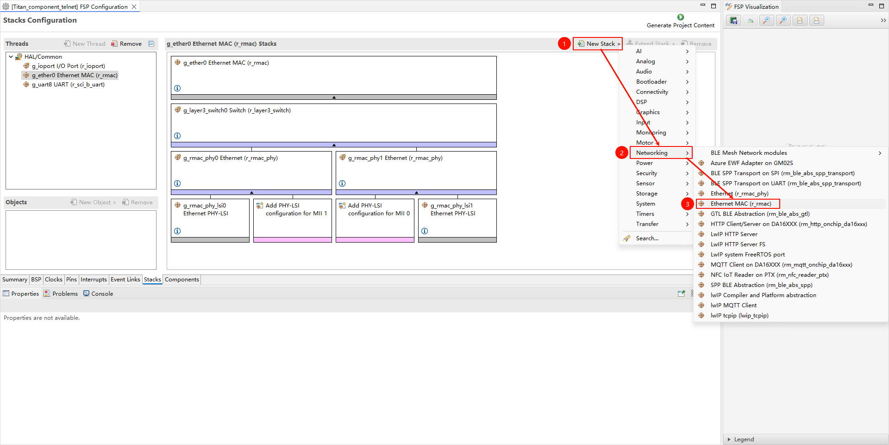

* 配置 r_mac stack：

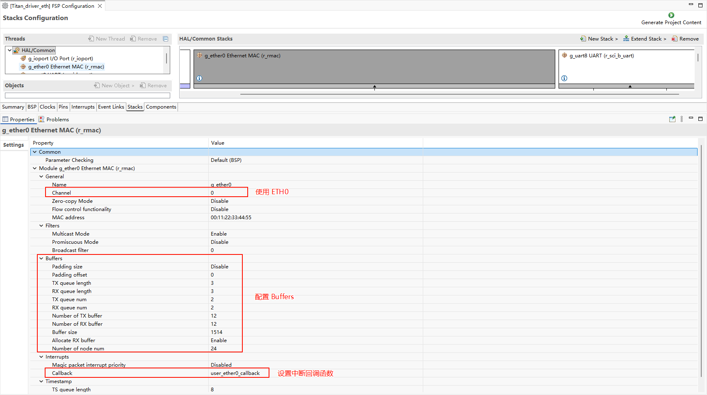

* 配置 r_layer3_switch：

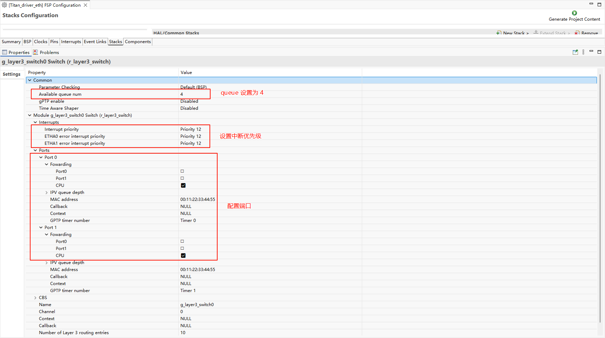

* 配置 r_rmac_phy：

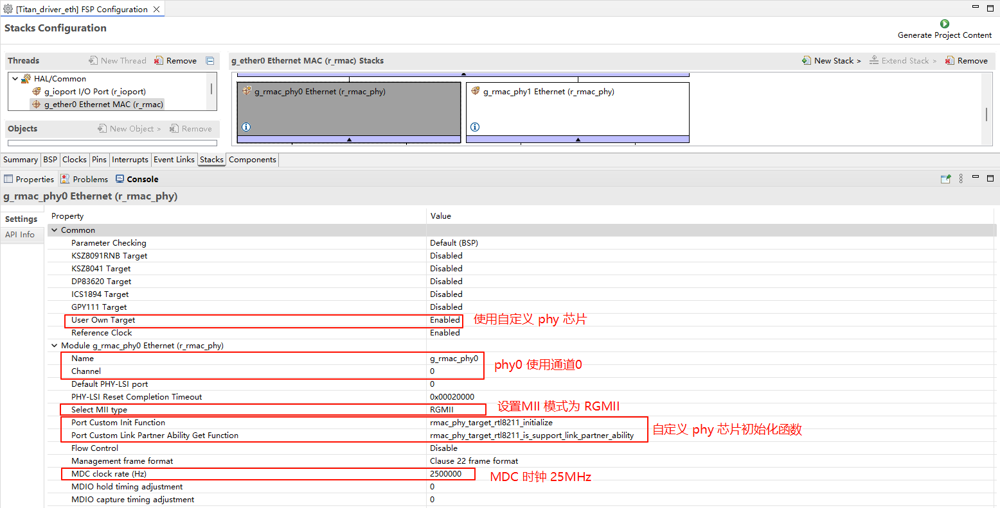

* 配置 g_rmac_phy_lsi0：

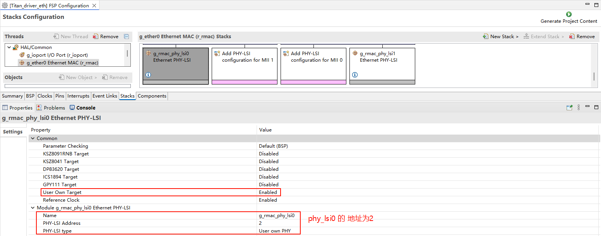

* ETH0 引脚配置：

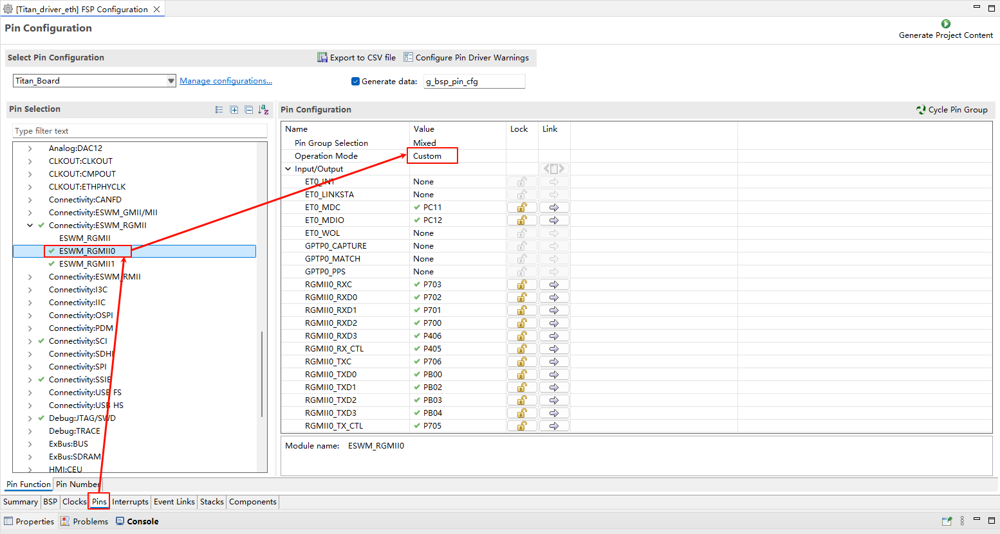

* **注意**：ETH 相关的所有引脚需要将驱动能力改为 H。

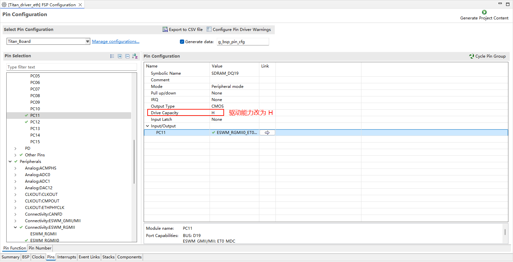

## RT-Thread Settings 配置

* 在 RT-Thread Settings 中使能 Ethernet。

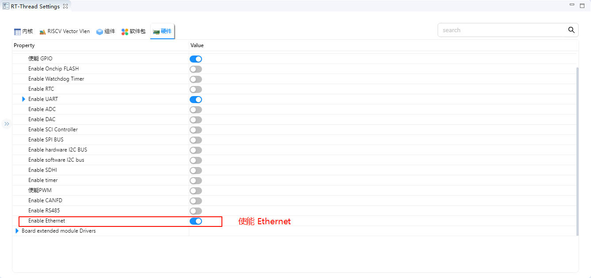

## 软件说明

### LwIP 性能调优建议

RT-Thread 上游 `rt-thread/components/net/lwip/Kconfig` 中的 LwIP 默认参数偏保守（PBUF 数量 16、TCP 发送缓冲 8196 等），无法充分发挥 RA8P1 千兆以太网 + DMA 的吞吐能力。建议在启用 `RT_USING_LWIP`（例如勾选 `BSP_USING_ETH`）后，按下列推荐值手动调优：

| 参数 | 默认值 | 说明 |
|------|-------:|------|
| `RT_LWIP_PBUF_NUM` | 256 | PBUF 缓冲池数量（上游默认 16） |
| `RT_LWIP_RAW_PCB_NUM` | 4 | RAW socket 数量 |
| `RT_LWIP_UDP_PCB_NUM` | 24 | UDP PCB 数量（上游默认 4） |
| `RT_LWIP_TCP_PCB_NUM` | 24 | TCP PCB 数量（上游默认 4） |
| `RT_LWIP_TCP_SEG_NUM` | 512 | TCP 段数量（上游默认 40） |
| `RT_LWIP_TCP_SND_BUF` | 65535 | TCP 发送缓冲（上游默认 8196） |
| `RT_LWIP_TCP_WND` | 65535 | TCP 窗口大小（上游默认 8196） |
| `RT_LWIP_TCPTHREAD_PRIORITY` | 6 | lwIP 主线程优先级（上游默认 10，数值越小优先级越高） |
| `RT_LWIP_TCPTHREAD_MBOX_SIZE` | 144 | lwIP 主线程邮箱大小（上游默认 8） |
| `RT_LWIP_TCPTHREAD_STACKSIZE` | 2048 | lwIP 主线程栈（上游默认 1024） |
| `LWIP_NO_TX_THREAD` | y | 不使用独立 TX 线程（发送路径直接调用，减少上下文切换） |
| `RT_LWIP_ETHTHREAD_PRIORITY` | 5 | 以太网线程优先级（上游默认 12） |
| `RT_LWIP_ETHTHREAD_STACKSIZE` | 2048 | 以太网线程栈（上游默认 1024） |
| `RT_LWIP_ETHTHREAD_MBOX_SIZE` | 144 | 以太网线程邮箱大小（上游默认 8） |

如需应用上述推荐值，可在 RT-Thread Studio 的 `RT-Thread Settings → RT-Thread Components → Network → lwIP` 中修改对应项，或直接编辑工程的 `.config`。

> ⚠️ **内存占用提示**：上述参数对 RAM 占用影响较大。`RT_LWIP_PBUF_NUM=256` + `TCP_SND_BUF/WND=65535` 在默认 `RT_LWIP_PBUF_POOL_BUFSIZE` 下会预留较多堆内存，请确认链接脚本中 heap 大小足够（建议 ≥ 256 KB）。

## 编译&下载

* RT-Thread Studio：在RT-Thread Studio 的包管理器中下载 Titan Board 资源包，然后创建新工程，执行编译。

编译完成后，将开发板的 USB-DBG 接口与 PC 机连接，然后将固件下载至开发板。

## 运行效果

将网线插入 网口，按下复位按键重启开发板，等待 PHY0 link up 之后输入 `ifconfig` 可以查看开发板获取到的 IP 地址，然后输入 `ping baidu.com` 命令进行连通性测试。

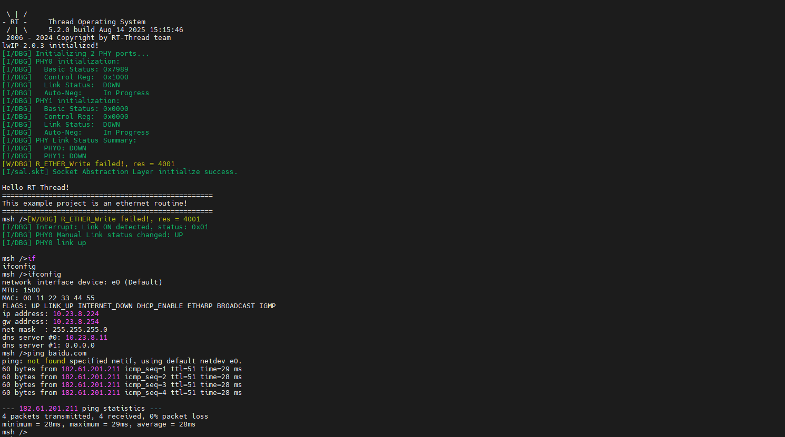

### iperf 测试

打开 RT-Thread Settings 添加 netutils 软件包并使能 iperf 工具。

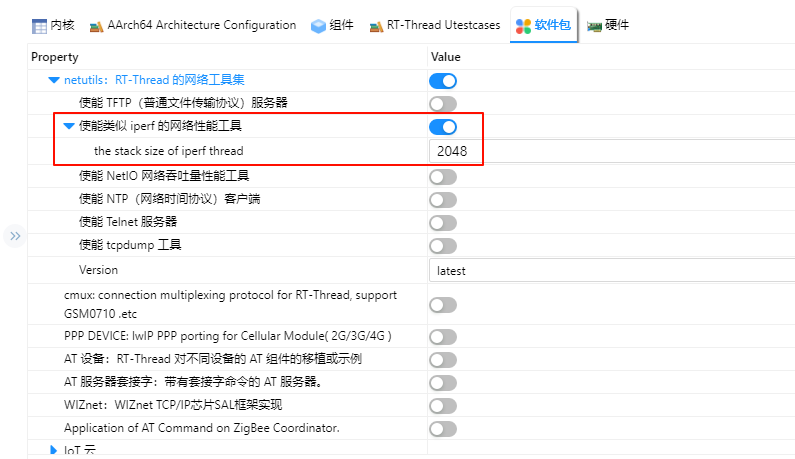

编译下载后在串口终端输入 `iperf -c 主机IP -p 5001` 进行 iperf 测试。

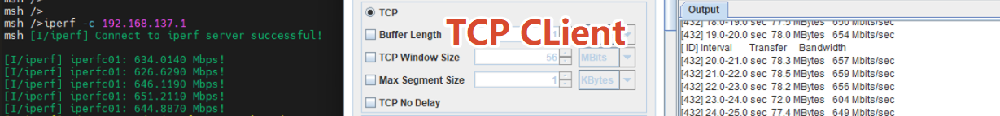

### 网络应用示例

借助 netutils 软件包，可以实现 TCP/UDP 的客户端与服务器收发测试。

**TCP Client 测试**：开发板作为客户端，主动连接远程主机并收发数据。

**TCP Server 测试**：开发板作为服务器，监听端口等待客户端连接。

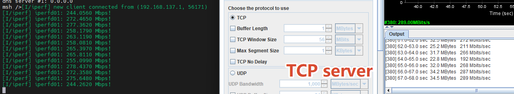

**UDP Client 测试**：开发板作为客户端，向远程主机发送或接收数据报。

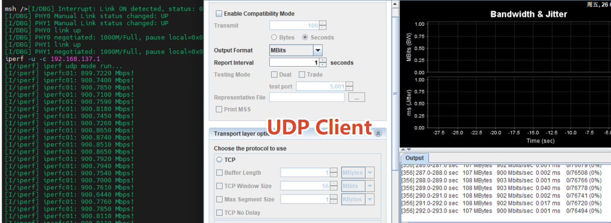

**UDP Server 测试**：开发板作为服务器，监听端口等待客户端数据报。

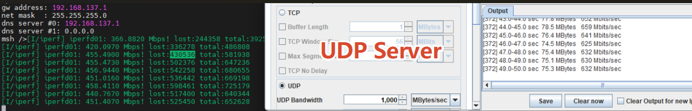

